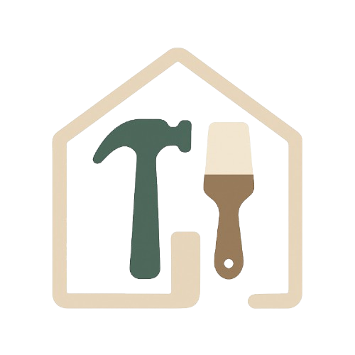

# 🛠️ Renomate – Room-by-Room Renovation Planner (PWA)

**Renomate** is a minimalist and collaborative renovation planning app designed for couples or homeowners. Built as a Progressive Web App (PWA), it works offline and syncs your renovation tasks, budgets, and progress room by room.



## Features

- 🏡 **Room Overview**: View each room with budget, tasks, and deadlines.
- ✅ **Tasks**: Add, check off, and comment on subtasks per room.
- 💸 **Budgets**: Track spending per room and per task.
- 📸 **Photos**: Upload before/after images for each room.
- ⏰ **Timeline**: Set and follow deadlines for each task or room.
- 📦 **Offline Support**: Full offline mode using IndexedDB.
- 🔄 **Data Export/Import**: Backup and restore your renovation data.

## Getting Started

### Running Locally

1. **Clone the repository**
   ```bash
   git clone <repository-url>
   cd oppuss
   ```

2. **Install dependencies**
   ```bash
   npm install
   ```

3. **Start the development server**
   ```bash
   npm run dev
   ```

4. **Open your browser** and navigate to http://localhost:5173

### Building for Production

```bash
npm run build
```

The built application will be in the `build` directory.

### Installing as a PWA

1. Visit the deployed app in a supported browser (Chrome, Edge, Firefox)
2. Open the browser menu
3. Look for "Install Oppuss" or "Add to Home Screen"
4. Follow the prompts to install

## Tech Stack

- **Framework**: [SvelteKit 4](https://kit.svelte.dev/)
- **Styling**: [Tailwind v4](https://tailwindcss.com/)
- **Storage**: IndexedDB via [Dexie.js](https://dexie.org/)
- **Authentication**: [Supabase](https://supabase.com)
- **PWA**: [@vite-pwa/sveltekit](https://vite-pwa-org.netlify.app/frameworks/sveltekit.html)

## Project Structure

```
oppuss/
├── src/                      # Source code
│   ├── lib/                  # Library code
│   │   ├── components/       # Svelte components
│   │   │   ├── room/         # Room-related components
│   │   │   ├── task/         # Task-related components
│   │   │   └── photo/        # Photo-related components
│   │   ├── services/         # Service modules
│   │   │   ├── db.ts         # Database service (IndexedDB)
│   │   │   ├── photos.ts     # Photo handling service
│   │   │   └── data.ts       # Data import/export service
│   │   ├── stores/           # Svelte stores
│   │   │   └── rooms.ts      # Rooms store
│   │   └── types.ts          # TypeScript types
│   ├── routes/               # SvelteKit routes
│   │   ├── +layout.svelte    # App layout
│   │   ├── +page.svelte      # Home page (Dashboard)
│   │   ├── room/[roomId]/    # Room detail page
│   │   └── settings/         # Settings page
│   └── app.css               # Global CSS
├── static/                   # Static assets
├── vite.config.ts            # Vite configuration
└── tailwind.config.js        # Tailwind CSS configuration
```

## Color Palette

| Purpose        | Name     | Hex       |
| -------------- | -------- | --------- |
| Primary        | Sand     | `#D8CAB8` |
| Accent         | Clay     | `#9E7C5D` |
| Text           | Charcoal | `#2E2E2E` |
| Contrast       | Snow     | `#FDFCF9` |
| Active/Success | Pine     | `#4B635E` |

## Development Notes

- Use optimistic UI updates for task completion
- Ensure accessibility (aria labels, keyboard nav)
- Add subtle animations for better user experience
- Test offline functionality regularly

## Future Enhancements

- Supabase Auth + Database for cloud sync
- QR code-based room sharing
- Push notifications for reminders
- Before/after photo comparison

---

Made with ❤️ by two people renovating their first home together.
